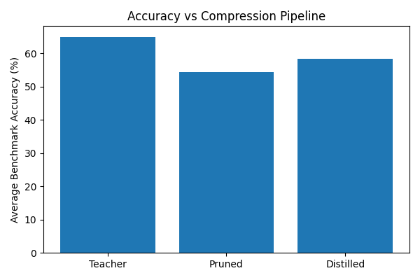
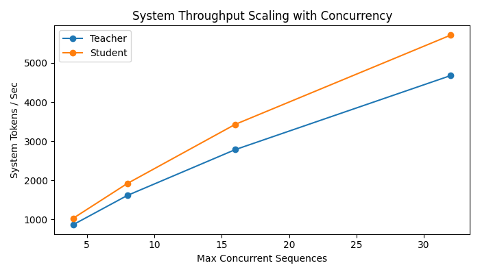
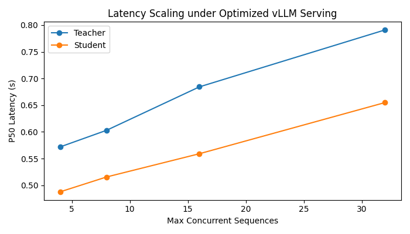
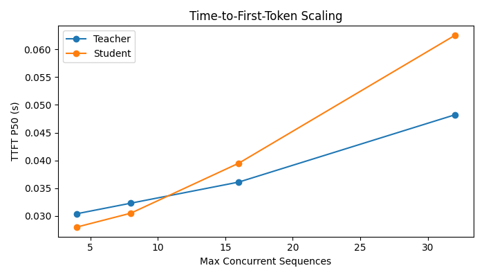
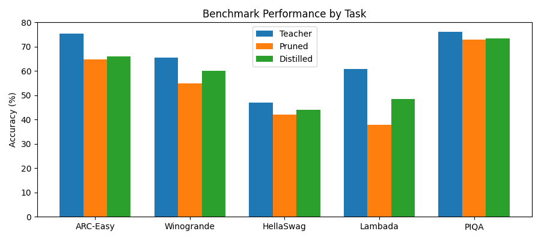

## Overview
The project explores deployment-aware transformer compression and efficient LLM inference using Qwen2.5 model. A teacher model was structurally depth-pruned and distilled to create a compact student model optimized for scalable serving workloads. Beyond evaluating benchmark accuracy across ARC-Easy, Winogrande, HellaSwag, Lambada, and PIQA, the project analyzes real-world inference behavior using vLLM, focusing on latency, throughput, concurrency scaling, and serving efficiency under continuous batching. The goal is to study the tradeoffs between transformer compression, reasoning quality, and high-throughput deployment performance for modern foundation models.
(Code coming soon)

## Compression Methdology
The compression pipeline follows a structured prune-and-distill strategy to reduce the depth of a model while preserving inference quality and deployment compatibility. Instead of removing layers sequentially, the pipeline first performs layer importance analysis using a calibration dataset to identify transformer blocks that contribute the least to representation changes within the residual stream. Importance scores are estimated by analyzing similarities between layer input and output activations, allowing the least impactful layers to be targeted for removal. Once identified, the selected transformer blocks are surgically removed from the model architecture, followed by dynamic layer re-indexing and configuration updates to ensure compatibility with standard Hugging Face and vLLM inference pipelines. This structured depth pruning approach enables efficient transformer compression while maintaining stable model execution and deployment readiness.

## Distillation Strategy
To recover performance degradation introduced by structural pruning, the compressed student model is further optimized using knowledge distillation. The distillation pipeline aligns the student model with the original teacher model through two complementary objectives: logit alignment and hidden-state trajectory matching. KL-divergence loss is applied to encourage the student to mimic the teacher’s soft output distributions, preserving reasoning behavior and prediction calibration across downstream tasks. In parallel, intermediate hidden-state alignment minimizes the representational gap between teacher and student residual streams, allowing the compressed model to retain structural knowledge lost during layer removal. This combination of output-level and representation-level distillation enables the student model to recover a significant portion of the pruned model’s benchmark degradation while maintaining improved inference efficiency and reduced model depth.

## Benchmarking and vLLM Serving Setup
Teacher, pruned, and distilled student models based on the Qwen2.5 model were evaluated using both downstream reasoning benchmarks and real-world inference serving workloads. Model quality was measured across ARC-Easy, Winogrande, HellaSwag, Lambada, and PIQA to assess the impact of structural pruning and knowledge distillation on commonsense reasoning and language understanding performance. For deployment evaluation, models were served using vLLM with an OpenAI-compatible inference pipeline under varying concurrency configurations (max_num_seqs = 4, 8, 16, 32) and both eager and optimized execution modes. A cleaned ShareGPT conversational dataset was used to generate realistic prompt workloads, and concurrent inference requests were executed through a multithreaded benchmarking framework leveraging continuous batching and chunked prefill scheduling. Benchmarks measured Time-to-First-Token (TTFT), end-to-end latency, per-request throughput, system-wide token throughput, and KV-cache utilization across different serving configurations, enabling analysis of compression-quality-performance tradeoffs under scalable transformer inference workloads. Automated warmup phases, GPU memory cleanup, and server lifecycle management were integrated to ensure stable and reproducible benchmarking conditions.

## Results 
Accuracy vs Compression Pipeline 

System Throughput Scaling with Concurrency 

Latency Scaling under Optimized vLLM Serving 

TFFT Scaling

Benchmark Performance by Task 

## Key - Findings
1. Structured depth pruning reduced the Qwen2.5 base model transformer architecture from 24 to 19 layers, achieving a 28.2% parameter reduction while maintaining strong downstream reasoning performance.
2. Direct structural pruning caused benchmark accuracy to decrease from 65.0% to 54.5% average accuracy, highlighting the sensitivity of transformer reasoning capability to aggressive layer removal.
3. Knowledge distillation partially recovered pruning-induced degradation, improving average benchmark accuracy from 54.5% to 58.5% and retaining approximately 90% of teacher model performance.
4. Under optimized vLLM serving configurations, the compressed student model consistently outperformed the teacher model in throughput and latency across all concurrency levels.
5. At 32 concurrent sequences, the student model achieved approximately 22% higher system throughput (5714 vs 4679 tokens/sec) while also reducing p50 latency from 0.79s to 0.65s.
6. Throughput gains increased as concurrency scaled, indicating that transformer compression benefits compound under higher KV-cache pressure and memory-constrained serving workloads.
7. Optimized execution (enforce_eager=False) dramatically outperformed eager execution for both teacher and student models, demonstrating the importance of continuous batching and scheduling optimizations in modern LLM serving systems.

## Key - Insight
1. Compression benefits grow with concurrency 
2. Distillation meaningfully recovers reasoning capability 
3. Decoding remains partially memory-bound 
4. Optimized serving dramatically outperforms eager execution 

## Future Work
1. Investigate post-training and quantization-aware compression techniques such as AWQ and FP8 quantization.
2. Explore speculative decoding and draft-model acceleration strategies.
3. Extend the prune-and-distill framework to multimodal transformer architectures and vision-language models
